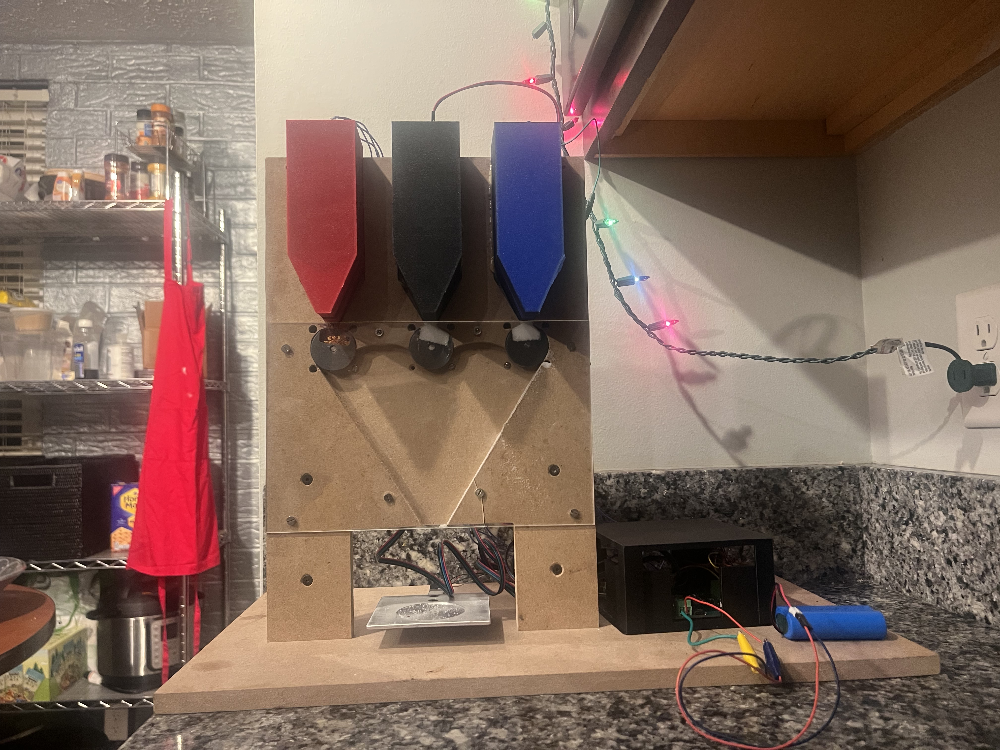
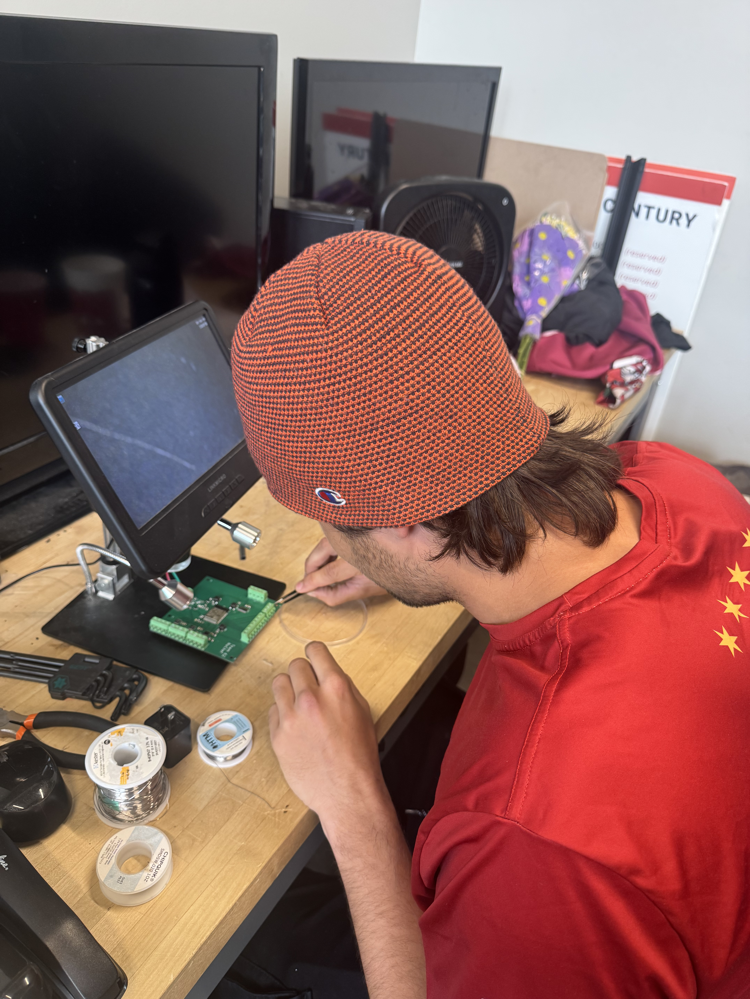
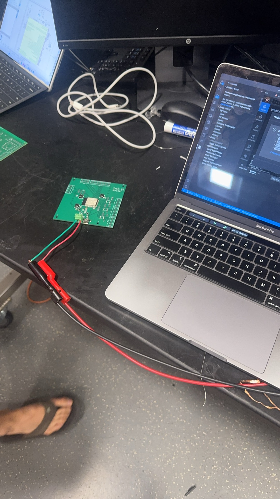
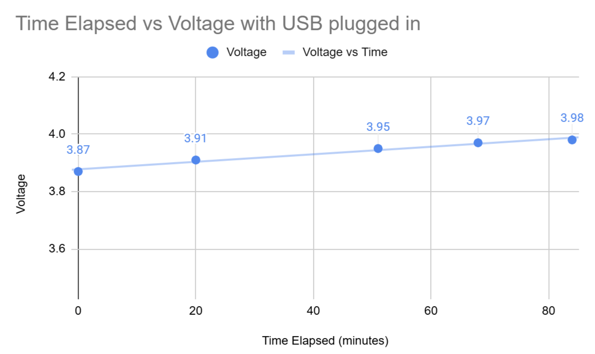
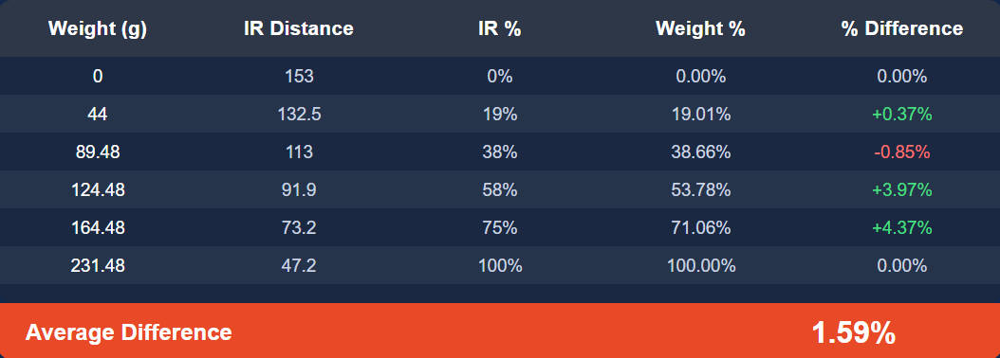
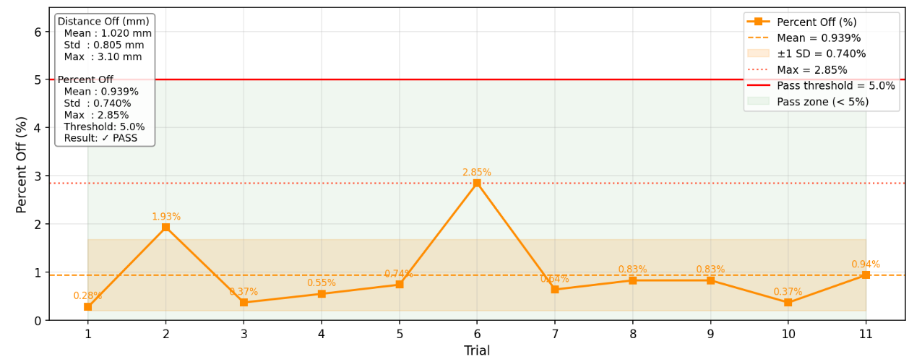

Febuary 4th

Objective: Figure out the physical design of what we want to make, and whether we want to use the machine shop.
Record of what was done: We discussed the physical design for a while. We discussed different ways of making a lazy susan design. Options include rotating the spice dispenser using ball berrings and a central motor, or rotating the cup to be dispensed to to the spice dispensers themselves. Pros of rotating the spice containers include increased visual appeal, less total motors, and simpler fittings for aligning spices (only need one funnel/dispensing shoot). Pros of rotating the cup include ease of design and less moving parts.

Febuary 5th

Objective: Meet with Greg/Machine Shop about ideas.
Record of what was done: Greg brought up the point that we really do not need to rotate anything. Everything can just be dispensed from their own containers into a central funnel. The downside of this is each spice container needs its own motor, increasing cost. Therefore, we settled on just 3 spices as essentially a proof of concept. Scaling does not increase the design complexity much. Can be made as soon as we supply motors.

Febuary 9th

Objective: Discuss additional hardware complexity.
Record of what was done: Settled on adding IR sensor for spice level detection. Two options for this. One, smoke detector style break beam detector. Two, IR time of flight sensor. Decided on IR Time of Flight for higher precision vs the digital high/low supplied by break beam style. Drew this image to explain how it worked to my groupmates.

Febuary 11th

Objective: Put in myece order request for load cells and motors.
Record: Ordered these parts from Amazon through my.ece
Load Cell
https://www.amazon.com/Wishiot-Precision-Miniature-Electronic-Portable/dp/B0C3QHT4TT/ref=sr_1_18?crid=YHTPU8K7PRR0&dib=eyJ2IjoiMSJ9.ZtfBVBQNOxQfS2RLniF4zJVTIeswGS6WmkaQ2EmqnAWr1R8vger4_pDiZ2euk6cIWGjregdFvOeWiDsReAurS0UYXRainXTYUk-QG1Kar69X53pMdBWGlf-Tr17roMO7grSCU-BvZ6UhLg4trPYlvaWqRR4G1spqeQVUTUfz06yyokeWtq6mjGF5unZnc15sofcRdEXps-s46nm1j4gdzahU57k0v8zQwIDBRcPwfDg.NsLVxuNE5ZvPOyESLpK9di_2pKtzg1X5-PoH1h3RUZ4&dib_tag=se&keywords=load+cell&qid=1778208926&sprefix=load+cel%2Caps%2C382&sr=8-18

Stepper Motors
https://www.amazon.com/STEPPERONLINE-Stepper-Bipolar-42x42x38mm-Connector/dp/B0B38GHRH8/ref=sr_1_5?crid=MPZIC8GPXWF8&dib=eyJ2IjoiMSJ9.hN-9QQUUabt-Xybqh_2heZ1beHCjbW0sVhGOsdmrCYtF9pC2RRg_t21PWD54Q4zSNgISEJ2SfiFH74Rl3Dc9I_2hlNBQUAqaO30FQkyQqsgNyQwXgb5fuh_wm3C2hRaMf7h5kmbTRDegiK256D2SiX6b6eJhIHbYGNB9iyCJbpnkGYnJT4oeXz8MGXJzHr7PQgqlB78Lz1JtoUl-8t0J3wMspDLAo3t2IQyZDh6o3Zs.7PPbeHkdu_9rmu1kFfhMCw_SWu9VS72QoQEWxrQEN6M&dib_tag=se&keywords=nema17%2Bstepper%2Bmotor&qid=1778209016&sprefix=nema17%2Bstepper%2Bmotor%2Caps%2C161&sr=8-5&th=1

Load cell is a 1kg load cell. Plenty large enough for the amount of spice we intend to measure, along with most smaller ingredients, while still providing enough precision for smaller amounts of strong spices.
Stepper motors are 1.5A, which on on edge of typical rated discharge current for lithium ion batteries. Will need to be careful in designing around this and to only run one motor at a time.

Febuary 17th

Objective: Take delivery of parts
Record: Took delivery of load cell and stepper motors. Delivered to Machine Shop. First order put in and should be done by end of week or early next week.

Febuary 20th

Objective: Start PCB schematic work.
Record of what was done: Have past PCB design experience, able to copy over microcontroller schematic, usbc port schematic, and voltage regulation schematic from prior project. AP2112 linear dropuot regulators a fine choice. Dropout will likely not be a problem as sensors are low current. Will need to figure out how to run higher current motors. Perhaps seperate battery pack. Will need to migrate ESP32 C3-Mini to ESP32 S3-Wroom for more GPIO pins though. Would have liked to reuse battery charging module, but the previously used MCP73871 looks hard to hand solder. Will need to look for an easier to solder version, perhaps in an SOT format. Attached are the copied schematics.

Febuary 24th

Objective: Finish Schematic
Record of what was done. Made rest of schematic decisions. Found MCP73831 battery charger unit. Major drawbacks from MCP73871 include inability to power system from USB and much smaller max charging speed. Huge benefit is SOT-23 format instead of QFN format with hidden pins. Good option for this type of project. 

Found DRV8833 motor drivers. Not technically a stepper motor driver, but rather dual H-Bridge, but capable of driving stepper motor at low voltages. This works here, as motors will be driven by 3.7V Lithium Ion battery.

Downsides of DRV8833 that are not relevent here
-Heats up more during continuous use (We will disable drivers when not in use)
-Can't handle higher voltages (We only have 3.7V available)
-Less Smooth/Precise (We only need to be able to do 180 degree rotations, so this lower precisions should not be an issue)

Benefit is simpler implementation and smaller footprint.

For load cell, HX711 differential analog to digital converter is used. This comes with load cells, but for integration (and class) purposes, we will build into our PCB. Used simpler wiring method that does not use the internal regulated analog supply. Our power rail should not be too noisy, and there are plenty of decoupling capacitors, and relatively low load demands on it, so this should be sufficient for getting resonably accurate readings. We won't be using the motor and load cell at the same time anyways, which would be the only thing that could pull the power supply low.

March 3rd

Objective: Routing
Record: Assigned footprints, routed full board. Settled on 0805 resistors and capacitors as a good balance between size and solderability. Found these cool screw hole terminals for all the wires from Pheonix Connect. Useful because we can remove and insert wires without soldering, which will be nice for testing. Went with max size of 100x100 mm just for ease. Included mounting holes. Did via stitching for the first time.

March 8th

Objective: Control stepper motor with microcontroller for breadboard demo
Record of what was done: We spent the first couple hours trying to communicate with an old ESP32 Wroom breakout module I had. We tried a bunch of things including putting the board in boot mode, powering it from a digital power supply, from battery, probing all the power lines, probing the breadboard for shorts, etc. Turns out our USB micro cable was broken. We swapped to a new cable and were able to communicate. We then wired a motor driver we got off Amazon. Turns out the part we got (TB6612FNG) was just two H bridges for DC motors, and was not designed for continuous current, and was burning up really quick, so we had to keep unplugging it. Still, we were able to spin our motors for the first time. 

We ordered some breakout boards for the actual parts we will use on the PCB, including a DRV8833 breakout board and an ESP32 S3 Wroom breakout board. That way we can verify everything will work for the final board.

March 12th

Objective: Submit PCB order for round 3
Record: Submitted order Thursday evening but was still able to be included in PCB round 3 order. 

March 28th

Objective: Get Load Cell working
Record: Amplifier which came with load cell was broken. Ordered a new HX711 breakout board. Also placed order for all of the PCB parts. Some were in stock with the school, some were ordered through digikey. HX711 was out of stock a lot of places for some reason so had to order through LCSC which cost a lot in shipping. PCBs came in this day as well.

April 5th

Objective: Get load cell working and motors driven by new driver.
Record: Easy swap to new motor drivers. Worked right away. Jackson got load cell working after I left.

April 12th

Objective: Start soldering
Record: Started well. Got microcontroller on. Pivoted to power circuitry. Put on two SOT-23 parts in battery charger and voltage regulator. Ended up with large bridge on voltage regulator. Accidently broke a pin off trying to remove bridge. We only had one of these chips so had to rush order new ones to put on. Nothing else to test until new chips come in as need regulated voltage for whole system.

April 14th

Objective: Get Power
Record: Put new voltage regulator on. No power. Do a lot of probing that reveals issue. First checked resistance between 3.3V net and ground, and it is resonably high, so there is no short. Then checked resistance between pins of voltage regulator and also found no short. Seems issue was again that I had broken a pin or in some way damaged the voltage regulator. Fix is to put a new voltage regulator on. Accidently ripped USB C port off, will need to put a new one on.

April 15th: Get Power
Record: Put new voltage regulator on and immediatly got 3.3V, which was good. Put on a new USB-C port on, along with the boot and reset buttons to try flashing. Powered up, put in boot mode, and was able to flash! Weirdly serial monitor was not working. I flashed simple hello world code, and nothing got printed to serial. Not sure where this issue came from as am able to flash fine, so clearly communication is working fine. Maybe just a code error. Not going to look into it right now. Soldered the rest of the board, but was too tired to rest anything.

April 18th

Objective: Test peripherals
Record: First time testing again have no power. This time I probe 3.3V and have an obvious short. Resistance is super low (like sub 1 ohm at places). Off initial visual inspection I guess the issue may be one or both of the LEDs, so I remove both, but this does not fix the issue. Then, using the micrometer, I identify the probe to be a short between pins on the HX711. I remove this and it fixes the short. 

After flashing the motor code, the motors will not run. Probing the motor controllers, I find that all of them have a short between all of the four input lines. This makes sense, as in the design, all 3 drivers share the same input lines, and the motor that is controlled is only toggled by each motor drivers sleep mode (awakening one motor driver at a time). By visual inspection (and by probing which has the lowest resistance), I was able to identify the middle motor driver as the cause of the short. After removing, other two motors are able to be controlled. Leave it at this for now.

April 20th

Objective: Put parts back on that I removed
Results: Soldered back on missing parts, did not check if they worked.

April 21st: Validate soldering
Results: All motors worked fine. Load Cell was weird to get working, as wires were hard to get good contact with, but got it going eventually.

April 24th

Objective: Figure out IR Sensors
Results: Unable to be communicated with. After some probing, find there are many shorts with the hidden pins of the IR sensor module. Abandon ship and order presoldered bare IR sensor.

April 27th

Objective: Get new IR sensors working
Results: After solder wires onto one of the modules, we get good readings in free space. That is, when testing it pointed at near objects such as the table, the readings given are pretty realistic. However, once put inside housing, readings are nonsense. Getting readings that increase in distacnce as spice level gets higher, vastly different readings for each of the 3 spice containers, and drifting calibration. Abandon for demo.

April 28th

Objective: Fix IR Sensor for final 10
Results: Identify IR Sensor issue is that IR cone is interacting with walls of containers before it interacts with spice. This was giving the nonsense readings. 3D print new spice containers that are larger than the cone width at bottom using 

cone diameter ≈ 2 × distance × tan(25° / 2)
=2 x 100mm * tan(12.5) = 44mm

So I made the container have 50mm square sides. This would ensure the IR sensor would only read the spice level. These printed over night.

April 29th

Objective: IR Sensor final testing
Results: After glueing on the IR sensors, we were able to calibrate using what we deemed to be fully filled and empty. We then ran all of our validation tests. For the IR sensors we found 1.6% error based off the mass percentage. We also did the motor spin test to find the drift and found it to be under 1% from intended full rotation. We validated the load cell comparing it to readings from a profesional scale and found the average error to  be under 1 gram. While we were doing this we were taking battery measurements and confirmed the battery was charging.

May 4th

Objective: Compete in Final 10
Results: Demoed our project to judges. Everything was still working. Did not win but honored to make final 10!

![Final}(../Images/IMG_9755.png)

