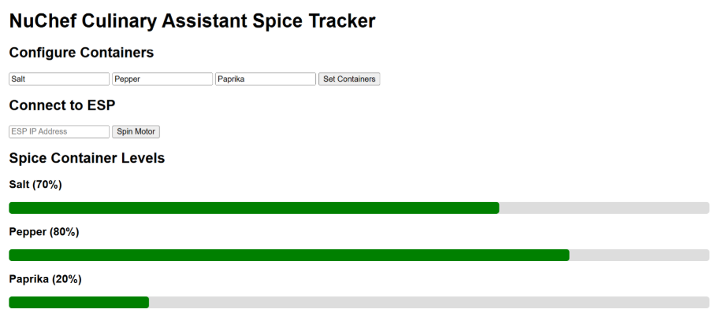
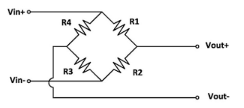

# Engineering Logbook

---

## Date: 2/10/26

### Objective
Parts purchasing for our project

### Details
The first major milestone for our project is deciding on the parts to buy. After meeting with my group and discussing parts, we have landed on the following components:

- ESP-32 S3 WROOM
- 10g load cell with HX711 ADC module
- 17HE15-1504 stepper motors
- VL53L4CD IR ToF sensors

The PCB and battery components will be decided by Griffin, who has the most experience in PCB design.

In addition to ordering these components, we also need the Oculus headset borrowed from the library or from Professor Gruev’s lab to run our computer vision model.

---

## Date: 2/15/26 – 2/17/26

### Objective
Begin setting up environment and learning to use PlatformIO in preparation to begin coding ESP

### Details
Parts have arrived and we have given them to the woodshop with our general idea and concept of a design. Once they have finished the frame for the spice dispenser, I will be able to begin programming the motors.

Until then, I learned how to set up my PlatformIO environment in VSCode to be able to program the ESP. I originally looked at the Arduino IDE, but PlatformIO worked better with VSCode and members of my group had more knowledge using it.

I followed this tutorial to get my environment set up:

<https://randomnerdtutorials.com/vs-code-platformio-ide-esp32-esp8266-arduino/>

---

## Date: 3/2/26

### Objective
To get the motors connected to the ESP and ensure that they can spin and properly be controlled.

### Details
The main frame has returned from the supply shop and I am able to start work coding the motors and the sensors. The physical rotation of the motors is the most essential part of the project, so I am starting with this first.

We ordered a TB6612FNG motor driver breakout board to be able to easily control our stepper motors. We also have an older ESP-32 with breadboard pins that can be used and coded on the breadboard.

The motors were chosen due to their precision, as 200 steps result in one full rotation back to the starting position with generally specific accuracy.

The motors have four wires — `A+`, `A-`, `B+`, and `B-` — as seen in this datasheet:

<https://www.artme-3d.de/wp-content/uploads/2024/03/17HE15-1504S.pdf>

These four lines create two coils that allow for a spinning magnetic field when current is alternated through them in different directions. This is how we are able to get rotation in the stepper motors.

The DRV8833 is able to abstract this pin control into two pins, `IN1` and `IN2`, as seen in this datasheet:

<https://cdn.sparkfun.com/assets/0/1/b/b/3/TB6612FNG.pdf>

We are able to wire PWM and STBY to high and connect IN1 and IN2 to two GPIO pins on the ESP. We can then use the `AccelStepper` library to abstract the coding of these pins, though we understand that the current must alternate between the four pins to get a complete rotation.

The `AccelStepper` library examples can be found here:

<https://registry.platformio.org/libraries/waspinator/AccelStepper/examples>

Using a very basic example and modifying the code slightly, we can get one rotation on the motor each time we reset the ESP.

### Motor Test Code

```cpp
#include <Arduino.h>
#include <AccelStepper.h>
#include <BluetoothSerial.h>

BluetoothSerial SerialBT;

#define AIN1R 32
#define AIN2R 14
#define BIN1R 15
#define BIN2R 33

#define AIN1M 13
#define AIN2M 12
#define BIN1M 21
#define BIN2M 27

AccelStepper stepperRight(
    AccelStepper::FULL4WIRE,
    AIN1R, AIN2R, BIN1R, BIN2R
);

AccelStepper stepperMiddle(
    AccelStepper::FULL4WIRE,
    AIN1M, AIN2M, BIN1M, BIN2M
);

void spinMotor() {
    Serial.println("Spin command received");

    stepperRight.setCurrentPosition(0);
    stepperRight.moveTo(200);

    stepperMiddle.setCurrentPosition(0);
    stepperMiddle.moveTo(200);
}

void setup()
{
    Serial.begin(115200);

    // Stepper Motors Setup
    stepperMiddle.setMaxSpeed(800);
    stepperMiddle.setAcceleration(200);

    stepperRight.setMaxSpeed(800);
    stepperRight.setAcceleration(200);
}

void loop()
{
    stepperRight.run();
    stepperMiddle.run();
}
```

The general idea is to set the speed and acceleration of the motors and then tell them to move to position `200`. This means taking 200 steps, which for our motors is one full rotation.

There are only two motors set up here because the ESP we are using on the breadboard has limited GPIO. We will be testing this code at a future date.

---

## Date: 3/8/26

### Objective
To get the motors hooked up on the breadboard and use the ESP code to spin them on command.

### Details
We spent a lot of time on this day figuring out our communication with the ESP. We had to try multiple different cables until we found one that connected properly to my laptop.

We also found that, on this specific ESP that we were using for breadboard testing, certain pins that we thought were GPIO (like GPIO 4) caused problems when trying to program the ESP. It would not accept code over USB when those pins were used. These pins are likely related to resetting or idling the ESP, so we avoided them as much as possible.

We also realized that our TB6612FNG breakout board was made for general DC motors, not specifically stepper motors. It was still able to work, but stepper motors require a constant current to hold their position even when they are not actively rotating. This resulted in the chips getting very hot, so we could not leave them plugged in for too long.

Regardless, we were able to hook up the motors (two at a time because of limited GPIO on the ESP) and get them spinning.

We ordered a DRV8833 breakout board, which is the chip we are actually using on our PCB.

---

## Date: 3/9/26

### Objective
To get the project more prepared for the breadboard demo. This includes building a basic backend and frontend web app to allow the ESP to be controlled with the laptop.

### Details
The first step in setting up a web app was deciding how to build it. I decided to use FastAPI, as I do not need much bandwidth and it is easy to learn and test. I used this in conjunction with Uvicorn to get my server running.

I used GET and POST endpoints to allow me to see internal data as well as communicate with the ESP. The frontend/backend code can be seen in the GitHub commit labeled **WiFi capabilities**.

### ESP WiFi Connectivity Code

```cpp
WebServer server(80);

const char* ssid = "Triangle";
const char* password = "houserules";

void connectWiFi() {
  WiFi.begin(ssid, password);

  Serial.print("Connecting");

  while (WiFi.status() != WL_CONNECTED) {
    delay(500);
    Serial.print(".");
  }

  Serial.println("");
  Serial.print("ESP32 IP: ");
  Serial.println(WiFi.localIP());
}

void loop()
{
  stepper.run();
  server.handleClient();
  stepperMiddle.run();
}
```

With this code, the ESP is able to listen over WiFi. The web app can then call the `spinMotor()` function, which results in the spices being dispensed.

The SSID and password need to be changed based on location. In this example, it is configured for my home network.

This is a basic but effective way to communicate with the ESP over WiFi, and we confirmed it with a simple web app that can spin the motors.

### Demo API Endpoints

| Name | Type | Description |
|---|---|---|
| `new_recipe` | POST | Used by the Meta Quest 3 to send the selected recipe JSON |
| `status_update` | POST | Used by the ESP32 to send IR sensor and load cell data |
| `set_containers` | POST | Used by the frontend to allow user configuration of spices |
| `container_info` | GET | Used by the frontend to get IR sensor readings and load cell readings |

### Additional Backend GET Endpoints

| Name | Type | Description |
|---|---|---|
| `get_status` | GET | Returns the entire system state |
| `get_spices` | GET | Extracts and returns spices from the recipe JSON |
| `get_spice_dispense` | GET | Returns only spices currently in the dispenser |
| `get_container_info` | GET | Returns information on all containers |

### Basic Frontend

The frontend has some basic configuration that will later be used to connect the Oculus-to-ESP pipeline.

The “Spin Motor” button is the most important part of the demo because it shows we can communicate with the ESP over WiFi and control the motors remotely.



---

## Date: 3/10/26

### Objective
To debrief the breadboard demo and discuss next steps.

### Details
At the breadboard demo, the ESP was having trouble connecting to the university WiFi. It also was not able to connect to my phone’s hotspot.

We completed the demo using physical buttons to show some functionality, but afterward we discussed how to resolve the networking issues.

We decided to switch the ESP communication method from WiFi to Bluetooth. Griffin has worked with ESP Bluetooth before and said it is relatively simple and reliable. This will be our plan moving forward.

---

## Date: 3/28/26

### Objective
To hook up the load cell on the breadboard and get it running before our progress demo.

### Details
The load cell amplifier that came with the load cell was not working; it seemed like the chip was faulty. We ordered new HX711 breakout boards that would arrive before the progress demo, although we had to pay extra for shipping.

While waiting for the load cell amplifiers to arrive, I began work on the ESP code for them.

The load cell has four wires coming out of it. These wires allow us to provide an input voltage and read the voltage across the resistance terminals within the load cell.

When tension is applied to the cell, the resistance values change slightly, which causes a change in the internal voltage and allows us to read the weight. We can see this in the diagram below:



The HX711 amplifier allows us to amplify this small voltage change into an actual reading. We can then use GPIO and the HX711 library to get weight readings.

### HX711 Test Code

```cpp
#include "HX711.h"

// HX711 circuit wiring
const int LOADCELL_DOUT_PIN = 19;
const int LOADCELL_SCK_PIN = 20;

HX711 scale;

void setup() {
  Serial.begin(115200);

  pinMode(LOADCELL_SCK_PIN, OUTPUT);
  digitalWrite(LOADCELL_SCK_PIN, LOW);

  scale.begin(LOADCELL_DOUT_PIN, LOADCELL_SCK_PIN);
  scale.tare();
  scale.set_scale((1250.0)/1.0); //(reading)/actual weight
}

void loop() {

  if (scale.is_ready()) {
    float reading = scale.get_units(50);

    if(abs(reading) <= 0.05){
        reading = 0.00;
    }

    Serial.print("HX711 reading: ");
    Serial.println(reading);

  } else {
    Serial.println("HX711 not found.");
  }

  delay(1000);
}
```

---

## Date: 4/5/26

### Objective
To get the load cell working and hook up both the load cell and the motors for the progress demo.

### Details
The motors were simple to hook up because they used the same wiring as before, but now with our new breakout boards using the correct chips.

For the load cell and HX711, the wiring was also relatively straightforward:

- Red → `E+`
- Black → `E-`
- Green → `A+`
- White → `A-`

Once these are connected to the HX711, we only need the `DATA` and `SCK` lines connected to the ESP.

- `SCK` controls the clock
- `DATA` is used to read the data

Using the code written previously, I was able to display readings on the serial monitor.

I placed a 1-gram weight on the scale, which produced a reading of `1250`. I used this value to calibrate the scale so readings would display in grams.

There is some noise on the load cell because it is a low-weight cell and therefore very sensitive to changes in current or voltage, including outside electrical noise.

To combat this, we poll many data points and average them before displaying a reading. This increases the time between readings, but the results are much closer to the expected value.

Tony had made a slightly more advanced web application, so I gave him the load cell code so he could quickly implement it before the progress demo.

---

## Date: 4/7/26

### Objective
Progress demo and part pickup

### Details
Our progress demo went very well.

I also received many parts from Aniket that we had ordered through the ECEB supply shop. These included many of the top-solder components for our PCB, such as:

- Capacitors
- Resistors
- ESP module
- Voltage regulator

The remaining parts are still arriving in the mail, but we are close to having everything needed to begin soldering.

---

## Date: 4/12/26

### Objective
To begin soldering

### Details
I met with the rest of the group and we learned from a friend how to use solder paste and the heat plate at Triangle to top-solder our board.

Things were going well, but the voltage regulator chip developed a large solder bridge. While trying to separate the pins, one of them broke off.

We decided to order a replacement with express shipping and wait for it to arrive before continuing.

---

## Date: 4/22/26

### Objective
To get the IR sensors connected to the system and working.

### Details
Griffin soldered a small PCB with the IR sensor for testing on the breadboard.

The issue is that the IR sensor we bought has contacts underneath the chip, making it difficult to tell whether any contacts are disconnected or bridged.

I tried hooking the chip up to the ESP. On the VL53L4CD sensor, the two primary GPIO-related lines are:

- `SCL` — clock
- `SDA` — data

I could not get any readings from the sensor, even after trying different GPIO pins, wires, and configurations.

We decided to stop using the hand-soldered IR sensors and instead purchased VL53L4CD breakout boards.

---

## Date: 4/25/26

### Objective
To hook up the new IR sensor breakout boards and get readings displayed on the serial monitor.

### Details
I used the new breakout boards on the breadboard to try to get readings from the IR sensors.

The code I used was the basic continuous example from the Adafruit VL53L0X library:

<https://registry.platformio.org/libraries/adafruit/Adafruit_VL53L0X/examples/vl53l0x_continuous/vl53l0x_continuous.ino>

I spent a lot of time moving wires around because I believed there was a problem with my pin assignments or wiring.

While working, I accidentally pulled one of the wires out of the load cell. This took a long time to repair because the wires had been glued in place by the ECEB wood shop.

In the end, I did not make much progress, but we discovered that we had a spare load cell available and swapped it into the project.

---

## Date: 4/27/26

### Objective
To get all of the load cells hooked up and working.

### Details
We spent time hooking the IR sensors to the breadboard and ensuring that the pin assignments were correct.

Eventually, using the basic code, we were able to get readings that appeared accurate. However, when the sensors were placed on our spice containers, the calculated percentages based on distance readings were incorrect.

We were not able to fully resolve the issue before the demo, but we ensured the rest of the project was ready for the final demonstration.

Everything else was functioning properly.

---

## Date: 4/28/26

### Objective
Rig up the new containers and IR sensors

### Details
Tony and Griffin spent time the previous day diagnosing the IR sensor issue. They realized that the sensors use a cone-shaped transmission pattern that was reflecting off the walls of our containers.

In short, the containers were too small and interfered with the IR sensor readings.

Griffin designed and 3D printed new containers.

Tony and I spent time replacing the plexiglass, which required:

- Drilling new screw holes in the wooden frame
- Installing a new sheet of plastic

We also glued the new spice containers in place and left them to dry overnight.

The next day we planned to attach the IR sensors to the tops of the containers and test them.

---

## Date: 4/29/26

### Objective
Ensure functionality of the IR sensors, test the full system, and take R&V data.

### Details
We were able to connect the IR sensors and observed far less interference from the walls of the new containers.

This produced much more accurate readings.

I attended another team meeting and left Tony and Griffin to finish collecting R&V data.

---

## Date: 5/4/26

### Objective
Present our project at the awards ceremony demo.

### Details
We presented our completed project at the awards ceremony in the ECEB.

We are very happy and proud of how the project turned out.

---