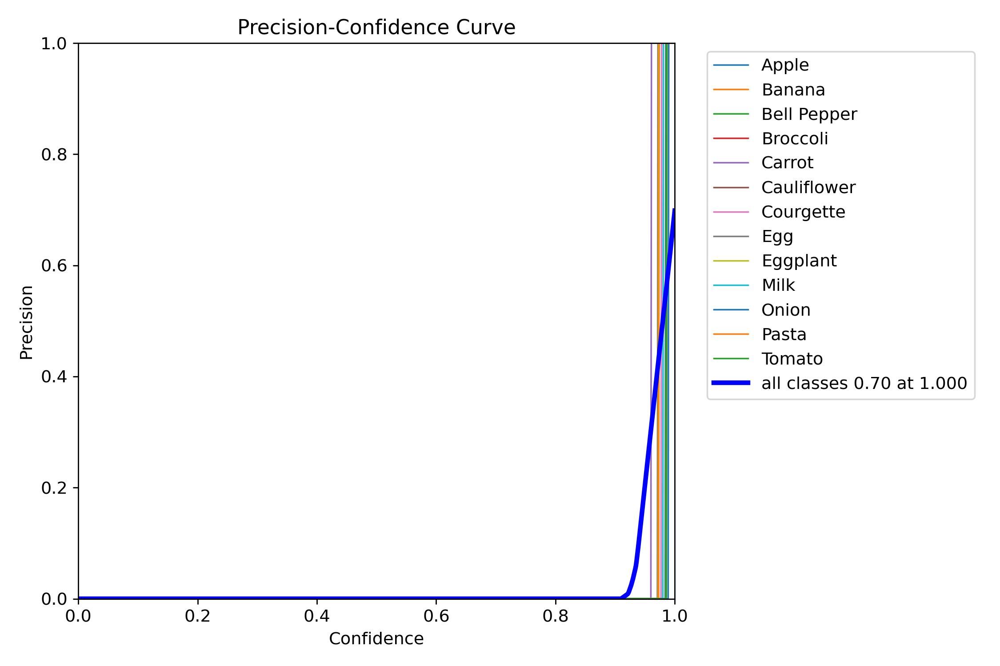
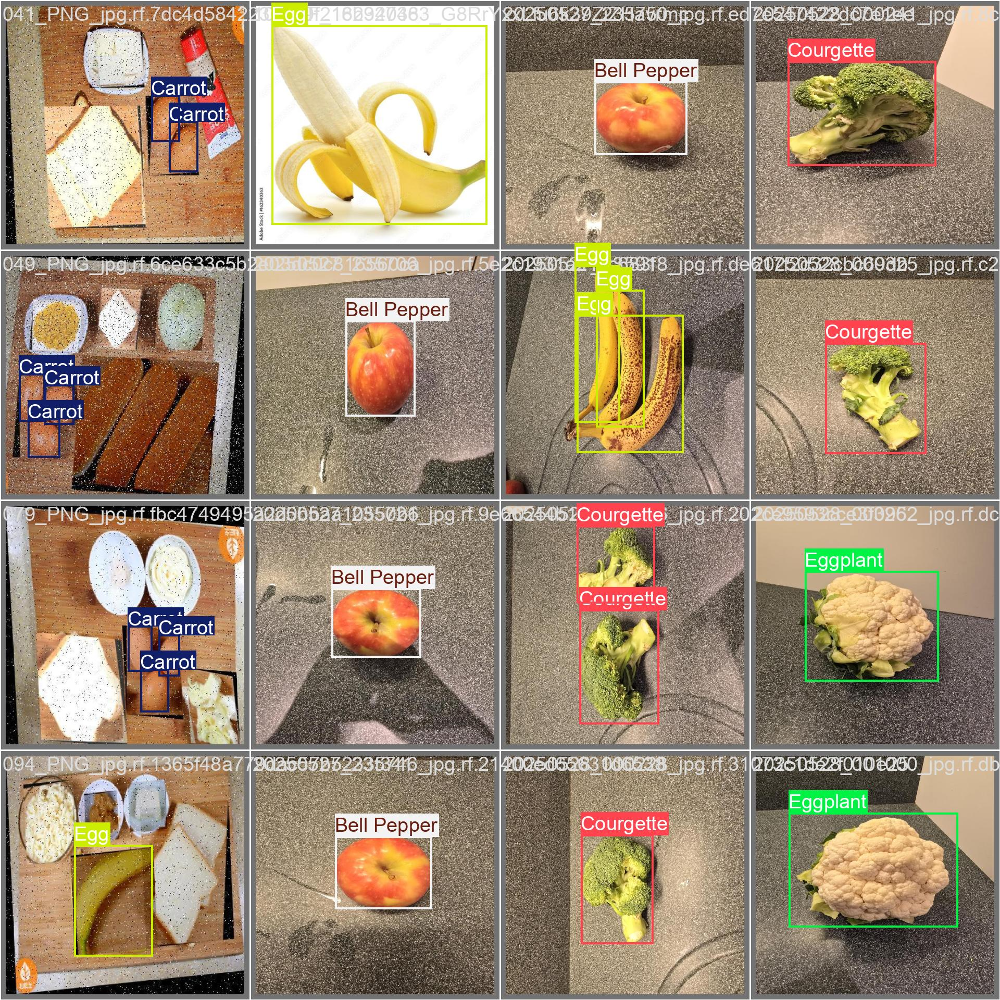
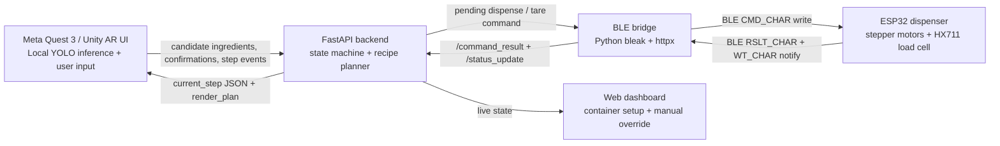
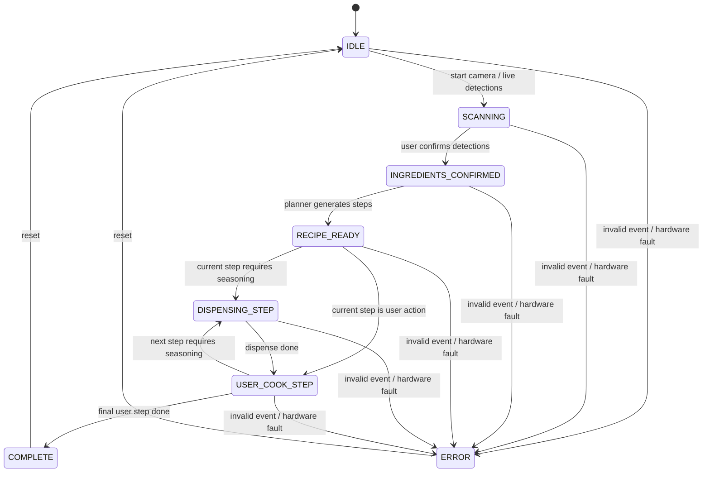

# Tony's Lab Notebook
## Vision Subsystem Development


## Table of Contents
- [Apr. 27th](#apr-27th)
- [Apr. 26th](#apr-26th)
- [Mar. 28th](#mar-28th)
- [Feb. 15th](#feb-15th)
- [Jan. 25th](#jan-25th)

---

# Apr. 27th

### Bug Fix — Confirmed Ingredient List (`DetectionManager.cs`)
- **Root cause:** `ConfirmVisibleIngredients()` called `m_confirmedInstances.Clear()` on every A-press, wiping previously accumulated markers each time the user stamped a new spatial anchor.
- **Fix:** Removed the `ConfirmVisibleIngredients` call from the A-press block entirely. The A-press now only calls `SpawnCurrentDetectedObjects()`. Ingredients remain candidates until the user presses **X**, at which point `RebuildConfirmedFromMarkers(m_spawnedEntities)` promotes the full accumulated marker list to confirmed in one shot.
- The confirmed list is now the spatial marker list — it can never lose data between A-presses.

---

### Feature — Per-Instance Ingredient Weighing (full pipeline verified)
Confirmed the end-to-end flow correctly tracks and measures every physical instance of an ingredient:

1. **A-press (LiveScan)** — spawns a spatial marker for each bounding box not already covered; markers accumulate across multiple A-presses. Multiple eggs in different locations each get their own marker.
2. **X-press** — `RebuildConfirmedFromMarkers` iterates every marker with no deduplication, building e.g. `["egg", "egg", "egg", "garlic"]`.
3. **Y-press (IngredientReview phase)** — full list POSTed to `/ingredients_confirmed`; backend `_build_ingredient_instances` expands it into `egg_1 "egg 1/3"`, `egg_2 "egg 2/3"`, `egg_3 "egg 3/3"`, `garlic_1`.
4. **`/ingredient_review` polling** — steps through each instance individually; `all_complete` only becomes `true` when every single instance has a recorded weight.

---

### Feature — AR Spatial Cues During Weigh-In (`IngredientReviewManager.cs`)
Added highlight and arrow cues that point to the exact spatial marker being weighed as the user navigates between ingredient instances.

**New Inspector fields:**
- `DetectionManager m_detectionManager` — provides access to `SpawnedMarkers`.
- `GameObject m_highlightPrefab` — assign `HighlightCuePrefab`; spawned in pulse mode.
- `GameObject m_arrowPrefab` — assign `ArrowCuePrefab`; bounces above the target marker.

**New private state:** `m_activeHighlight`, `m_activeArrow` — destroyed and recreated on every index change.

**`ClearCues()`** — destroys active cue objects; called from `EndReview()` and before every `UpdateCues()` call.

**`UpdateCues()`** — called at the end of every `UpdateHud()`. Iterates `SpawnedMarkers`, filters by `current.label`, picks the Nth match using `instance_index - 1` (backend is 1-based), then instantiates the highlight (pulse) and arrow on that marker's transform. Uses `GetComponentInChildren` to support nested prefab hierarchies.

---

### Feature — Recipe Complete Hides HUD (`RecipeGuidanceManager.cs`)
Previously when `action == "complete"` arrived, `IsGuiding` was set to `false` but `ClearGuidance()` was never called, leaving the HUD panel and AR cues visible.

**Fix:** Added `m_cueRenderer?.ClearCues()` and `m_hudController?.Hide()` directly in the `action == "complete"` branch of `ApplyStep()`, consistent with what `ClearGuidance()` already does on external stops.

---

### Feature — Confirmed Ingredient Count Display (`web_app/main/`)

**`script.js`**
- Replaced plain `renderList("confirmed-list", ...)` with a new `renderConfirmedList()` function.
- Reads `ingredient_instances` (already present in `/state`) to display per-label counts and average measured weights: e.g. `egg ×3  58.2g avg`.
- Falls back to `confirmed_ingredients` (plain unique labels) before X is pressed.

**`style.css`**
- Added `.ing-count` — accent-blue pill badge showing `×N` for any label with more than one instance.
- Added `.ing-weight` — muted green text showing average measured weight once instances are weighed.

---

### Feature — Ingredient Count Context Sent to LLM (`backend.py`)
Strengthened the `RECIPE_PLANNER_INSTRUCTIONS` prompt with an explicit description of `ingredient_summary`:
- `count` = number of physical items the user detected and marked (e.g. `count=3` means 3 eggs).
- `total_weight_g` / `average_weight_g` to scale seasoning correctly.
- Instruction to mention count in `display_text` / `voice_text` for grab/move steps when `count > 1` (e.g. "Pick up all 3 eggs").

---

### Inspector Wiring Required (Unity Editor)
On the `IngredientReviewManager` component, assign:
- `m_detectionManager` → the scene `DetectionManager` GameObject
- `m_highlightPrefab` → `HighlightCuePrefab` from `DetectionManager/Prefabs/`
- `m_arrowPrefab` → `ArrowCuePrefab` from `DetectionManager/Prefabs/`

---

# Apr. 26th
### Backend — `Software/src/web_app/backend.py` (1238 lines, heavily expanded)

**LLM Recipe Planner (replaces mock placeholder)**
- `_generate_llm_recipe()` calls the OpenAI Responses API with a strict JSON schema (`RECIPE_PLAN_SCHEMA`) and a `RECIPE_PLANNER_INSTRUCTIONS` system prompt.
- Pydantic models `RecipePlan`, `RecipeStep`, `DispenseSpec`, `SelectorTarget` validate LLM output before any state change.
- `_postprocess_recipe_plan()` normalizes + sanitizes the LLM result; falls back to mock on any failure.
- Controlled by env vars: `USE_LLM_PLANNER=1`, `OPENAI_API_KEY`, `OPENAI_MODEL`. Auto-loads a `.env` file.
- `system_state["last_planner_status"]` tracks whether LLM succeeded or fell back.

**Richer Step Schema**
- Every step now carries: `step_id` (unique hash), `render_plan` (focus + assist presets), `completion_mode` (`user_confirm` / `dispense_done` / `timer_done` / `auto`), and `targets` / `destination` (selector objects for AR cue resolution).
- `_compile_render_plan(step)` maps action types (`grab`, `season`, `move`, `mix`, `wait`, `complete`, etc.) to `focus_preset` + `assist_preset` pairs.
- `_resolve_default_completion_mode(action)` maps action → completion_mode automatically.
- `_build_step_status(step)` builds the enriched `/current_step` response including live dispense weight.
- `schema_version` field added to step payloads for forward compatibility.

**New Endpoints**
- `POST /vision_frame` — Quest posts structured YOLO frame (≤20 detections); updates candidate ingredients, frame count, receive timestamp.
- `POST /rv_event` — R&V latency probe; Quest sends `quest_send_ms`, backend computes end-to-end latency and updates p50/p95/max.
- `GET /rv_state` — Compact PASS/FAIL verification snapshot for the dashboard R&V panel.
- `POST /tare` — Zeroes the load cell reference weight in system_state.

**R&V Telemetry added to system_state**
- `last_vision_frame`, `vision_frame_count`, `vision_last_receive_ms`
- `rv_event_count`, `rv_duplicate_count`, `rv_latency_p50_ms`, `rv_latency_p95_ms`, `rv_latency_max_ms`

---

### ESP32 Firmware — `Software/src/esp_driver/src/main.cpp` (complete rewrite to BLE)
- Was: WiFi HTTP polling loop (`HTTPClient`).
- Now: BLE GATT peripheral advertising as `"NuChef-Dispenser"` with a custom GATT service.
- Three GATT characteristics:
  - `CMD_CHAR` (Write) — receives dispense commands as JSON
  - `RSLT_CHAR` (Notify) — sends `command_result` JSON back
  - `WT_CHAR` (Notify) — sends periodic weight heartbeats
- Motor wiring changed to TB6612 + FULL4WIRE steppers; all 3 motors share 4 coil-drive pins, selected by individual ENABLE lines.

---

### New File — `Software/src/web_app/ble_bridge.py`
- Async Python script (`bleak` + `httpx`) acting as BLE ↔ HTTP glue layer.
- Scans and connects to ESP32 peripheral by service UUID, with device-name fallback.
- Polls `GET /pending_command` every second; writes command JSON to `CMD_CHAR`.
- Subscribes to `RSLT_CHAR` and `WT_CHAR` notifications; forwards to `POST /command_result` and `POST /status_update`.
- Handles auto-reconnect on disconnect.

---

### New Unity Scripts (`DetectionManager/Scripts/`)

**RecipeGuidanceManager.cs**
- Polls `/current_step` at 0.3 s intervals; detects `step_id` changes to avoid redundant cue updates.
- Resolves target ingredient transforms via SceneObjectRegistry; hands step + targets to CueRenderer.
- Runs completion watchers: `WatchDispenseDone()`, `WatchTimerDone(duration_s)`, `WatchAutoAdvance()`.
- Exposes static `IsGuiding` bool that gates all DetectionManager input.
- `StopGuidance()` clears AR cues + hides HUD; does NOT reset backend recipe.

**RecipeStepPayload.cs**
- Full serializable data model for `/current_step` JSON: `schema_version`, `step_id`, `RenderPlan`, `SelectorTarget`, `StepStatus`, `completion_mode`, `targets`, `destination`.

**CueRenderer.cs**
- Spawns / repositions / destroys AR cue GameObjects from Inspector prefab slots.
- Maps `focus_preset` values (`soft_highlight`, `pulse_highlight`, `success_pulse`, `text_panel_only`) and `assist_preset` values (`ghost_hand_grab`, `arrow_to_target`, `ghost_hand_move`, `arrow_dispenser_to_target`, `ghost_hand_sprinkle`, `timer_ring`) to prefabs.

**ArrowCueController.cs**
- Animated bouncing arrow positioned above a target transform.

**HighlightCueController.cs**
- Soft / pulse alpha+scale highlight that follows a target transform. Two modes: `soft_highlight`, `pulse_highlight`.

**GuidanceHudController.cs**
- In-HMD World Space HUD: step instruction text, spice name, gram progress bar, timer countdown.
- All UI fields optional (null-safe); supports legacy `UnityEngine.UI.Text` or TMP swap.

**HudFollowCamera.cs**
- Lazy lerp follow so the HUD drifts with head pose (`m_posLerpSpeed`, `m_rotLerpSpeed`, `m_billboardYOnly`) instead of rigidly attaching to the camera.

**SceneObjectRegistry.cs**
- Resolves a label string → `Transform`. Priority: spawned spatial marker > live YOLO detection box > null.

**VisionRvHudController.cs**
- Togglable in-headset R&V debug overlay: live inference FPS, per-detection list, planner/backend state, latency stats (p50/p95/max).

**MarkerReviewRaySelector.cs**
- Ray-selector for ingredient-review phase using `Physics.Raycast` against marker colliders (NOT `EnvironmentRaycastManager` — that hits real-world geometry, not Unity GameObjects).

---

### New Test Tools — `Software/src/web_app/tools/`

**connection_soak_test.py**
- 30-minute soak test polling `GET /state` (or `GET /rv_state`) every second.
- Logs to `results/connection_soak.csv`; reports max reconnect gap.
- Acceptance criterion: no connectivity gap > 5 s.

**latency_burst_test.py**
- Bursts `POST /rv_event` at 10 Hz for 60 s; measures end-to-end latency.
- Logs to `results/latency_burst.csv`; reports PASS/FAIL.
- Acceptance criterion: p95 ≤ 150 ms AND dropped = 0.

---

### `backend_llm_ready.py` (721 lines)
- Clean snapshot of the backend with LLM integration + core state machine but without R&V telemetry endpoints. Kept as reference/backup alongside the full `backend.py`.

---

### Architectural Shifts Summary

| Area | Mar. 28 baseline | Apr. 26 |
|---|---|---|
| Recipe generation | `_generate_mock_recipe()` placeholder | Real OpenAI LLM call with strict JSON schema + Pydantic validation, mock as fallback |
| ESP32 comms | WiFi HTTP polling loop | BLE GATT peripheral + separate `ble_bridge.py` relay |
| Step payload | `instruction`, `type`, `dispense` | + `step_id`, `render_plan`, `completion_mode`, `targets`, `destination`, `schema_version` |
| AR guidance | Not implemented | Full `RecipeGuidanceManager` + `CueRenderer` + 4 cue controllers |
| HUD | Not implemented | `GuidanceHudController` + `HudFollowCamera` lazy follow |
| R&V verification | Not implemented | `/vision_frame`, `/rv_event`, `/rv_state` + `VisionRvHudController` + 2 CLI test tools |
| Label resolution | N/A | `SceneObjectRegistry` (marker-priority lookup) |

---

# Mar. 28th
<p align="center"></p>
### API Contract — `Software/doc/api_state_contract.md`
- Created new contract doc freezing all state names, canonical spice strings, and JSON payload shapes for Quest ↔ Backend ↔ ESP32
- Full endpoint reference table

### Backend — `Software/src/web_app/backend.py`
- Built full FastAPI state-machine orchestrator from scratch
- `system_state` dict as single source of truth (`demo_state`, ingredients, recipe, steps, dispense status, weight, containers)
- All endpoints implemented: `/state`, `/reset`, `/candidate_ingredients`, `/ingredients_confirmed`, `/generate_recipe`, `/current_step`, `/advance_step`, `/dispense_step`, `/pending_command`, `/command_result`, `/status_update`, `/set_containers`, `/manual_override`, `/manual_dispense`
- Mock recipe generator placeholder (`_generate_mock_recipe`) — swap for LLM call later

### Web Dashboard — `Software/src/web_app/main/`
- `index.html` — three-column layout: ingredients, recipe steps, hardware
- `script.js` — polls `/state` every 2s; all button actions wired; renders live state badge, step list, container level bars, load cell weight, pending ESP32 command
- `style.css` — dark theme, state-colored badges, step progress visualization

### ESP32 Firmware — `Software/src/esp_driver/src/main.cpp`
- Full rewrite from passive `WebServer` → active `HTTPClient` polling loop
- Polls `GET /pending_command` every 1s; runs closed-loop dispense; POSTs to `/command_result`
- HX711 load cell tared on boot; ±0.2g tolerance, 15s timeout
- 3 motors in `AccelStepper::DRIVER` (step/dir) mode, indexed by `container_index`
- `TEST_MOTOR_INDEX` constant: set `0/1/2` for single-motor testing, `-1` for production
- `platformio.ini`: added `HX711` + `ArduinoJson`, removed TB6612

### Unity — New Files (`DetectionManager/Scripts/`)
- `DetectionResult.cs` — structured detection model (`ClassId`, `ClassName`, `Score`, `BoundingBox`); replaces raw tuple
- `IngredientInventoryManager.cs` — candidate stability tracking (SeenCount + timeout), confirmed list, periodic POST on set change
- `BackendClient.cs` — all HTTP traffic via `UnityWebRequest` coroutines; configurable `m_baseUrl`

### Unity — Modified Files
- `SentisInferenceRunManager.cs` — `m_detections` → `List<DetectionResult>`; NMS preserves score + class name; calls `m_ingredientInventory.UpdateCandidates()` each inference frame
- `SentisInferenceUiManager.cs` — added `DrawUIBoxes(List<DetectionResult>...)` overload; existing rendering untouched
- `DetectionManager.cs` — added `m_ingredientInventory` + `m_backendClient` references; A button confirms ingredients + triggers recipe generation; B button also clears inventory

### Next Steps
> Inside the esp_driver folder, change backend IP address to ***new IP address every time***

> Inside the Unity files
    - Add IngredientInventoryManager and BackendClient as components on a GameObject in your scene
    - Wire the m_ingredientInventory and m_backendClient serialized fields in SentisInferenceRunManager and DetectionManager in the Inspector
    - Set m_baseUrl in BackendClient to your backend machine's LAN IP


# Feb. 15th
**Source basis:** Uploaded project proposal, Lab-Notebook guideline, `NuChef_Vision_Model_Bakeoff.ipynb`, `ingredients.png`, `ingredients_debug_pred.jpg`, and related NuChef project files available in this ChatGPT workspace.

> Note: Exact dates of the original conversations were not available, so the entries below are reconstructed dated entries for notebook use.

---

## Entry 1 - Vision subsystem objective and model-bakeoff plan

**Date:** 2026-02-07

### Objective

Define a practical comparison workflow for the project vision subsystem. The project goal is to recognize available ingredients from headset camera imagery, produce a structured ingredient list, and feed that list into recipe generation and AR guidance. The proposal allowed YOLOv8/YOLO11 or FastSAM for candidate regions, followed by CLIP-style classification if needed.

### Record of work

- Decided that YOLO should be the first working baseline because it gives both localization and class labels in one pass.
- Framed the notebook as a vision model bakeoff rather than a single training script.
- Selected the comparison candidates:
  1. YOLOv11 pretrained baseline.
  2. YOLOv11 fine-tuned on the ingredient dataset.
  3. CNN crop classifier baseline trained on ground-truth crops.
  4. Tracking plus temporal smoothing to reduce repeated detector computation.
- Defined the goal of the notebook output as a concise performance table comparing accuracy, precision, recall, F1, and inference time.

### Decisions and rationale

- YOLO-first was chosen because it is the fastest route to an end-to-end Quest/AR demo with boxes and labels.
- CNN crop classification was kept as a diagnostic baseline: if crops classify well but YOLO end-to-end performs poorly, localization or dataset/domain shift is the bottleneck.
- Tracking was included because real-time headset guidance may not need detector inference on every frame.

### Figures / attachments

- **Fig. 1:** `ingredients.png` - example crowded ingredient test image used to stress-test detection.
- **Fig. 2:** `ingredients_debug_pred.jpg` - debug prediction image showing excessive low-confidence boxes and class confusion.

---

## Entry 2 - Notebook setup and dataset interface

**Date:** 2026-02-01

### Objective

Create a reusable Jupyter notebook scaffold that can run locally or in Colab and point to a YOLO-format ingredient dataset.

### Record of work

- Built notebook setup cells for optional Colab Drive mounting and optional pip installs.
- Imported `os`, `time`, `math`, `random`, `shutil`, `dataclasses`, `pathlib`, `typing`, `numpy`, `pandas`, `yaml`, `cv2`, and `torch`.
- Set a fixed random seed, `SEED = 445`, for reproducibility.
- Added a CUDA/PyTorch diagnostic cell to report whether GPU acceleration is available.
- Added configuration variables:
  - `DATA_YAML = os.getenv("NUCHEF_DATA_YAML", "data/data.yaml")`
  - `YOLO_BASE_WEIGHTS = os.getenv("NUCHEF_YOLO_BASE", "yolo11n.pt")`
  - `YOLO_FT_WEIGHTS = os.getenv("NUCHEF_YOLO_FT", "PATH/TO/best.pt")`
  - `EVAL_SPLIT = "test"`
  - `CONF_THRESH = 0.25`
  - `IOU_THRESH = 0.50`
  - `WARMUP_ITERS = 5`

### Decisions and rationale

- Environment variables were used so the same notebook could run on different machines without editing code.
- The default model was `yolo11n.pt` because the nano model is more realistic for edge/headset-style inference and later Unity Sentis deployment.
- The test split was selected as the default for final comparison; validation split can still be used during development.

---

## Entry 3 - Dataset parsing and class-frequency analysis

**Date:** 2026-02-03

### Objective

Read the YOLO `data.yaml` file, locate the split image/label directories, parse labels, and understand class frequency.

### Record of work

- Implemented helpers to load `data.yaml` and normalize the YOLO class names list/dictionary.
- Implemented split directory resolution using the dataset path declared inside `data.yaml`.
- Inferred the matching labels directory by replacing `images` with `labels`.
- Implemented generic YOLO label parsing that works for detection labels and segmentation-style labels by reading class id plus remaining floats.
- Counted ground-truth object frequency per class over the selected image split.
- Displayed the top 20 most common classes.
- Generated `SUGGESTED_CORE` from the top-K most frequent classes, with `TOPK` initially set to 50.

### Decisions and rationale

- The bakeoff should not blindly train/evaluate on extremely sparse classes.
- A top-K core class list gives a practical way to target 30-50 reliable ingredient/object classes for a demo.
- Sparse or non-core classes can either be dropped or mapped to `unknown`, depending on whether the goal is clean classification or robust demo behavior.

---

## Entry 4 - Filtered dataset generation

**Date:** 2026-02-06

### Objective

Create a smaller filtered dataset focused on core ingredients/classes and optionally map all non-core detections to an `unknown` class.

### Record of work

- Implemented `make_filtered_dataset()` to copy/hardlink image files into a new dataset folder.
- Remapped labels from original class ids into a new core-class index set.
- Added `ADD_UNKNOWN = True` to map non-core labels into an `unknown` class.
- Added `DROP_NONCORE = False` as an alternate behavior for dropping non-core labels.
- Wrote a new filtered `data.yaml` containing the remapped class names.

### Decisions and rationale

- Keeping an `unknown` class is useful for real kitchen scenes where the image contains many objects that are not part of the supported recipe pipeline.
- Filtering classes makes the training objective match the demo objective: stable recognition of a manageable set of ingredients rather than broad open-world object recognition.

---

## Entry 5 - YOLOv11 fine-tuning section

**Date:** 2026-02-15

### Objective

Fine-tune a YOLOv11 detector on the ingredient dataset and save the best checkpoint for comparison against the pretrained baseline.

### Record of work

- Imported `YOLO` from `ultralytics`.
- Defined `RUNS_DIR` so training artifacts are saved inside the current project folder.
- Implemented `train_yolo_ultralytics(weights, data_yaml, task, epochs, imgsz, batch, device, project, name)`.
- Configured training with:
  - `weights = YOLO_BASE_WEIGHTS`
  - `data = DATA_YAML`
  - `task = "detect"`
  - `epochs = 50`
  - `imgsz = 640`
  - `batch = -1` for automatic batch selection
  - `device = 0`
  - run name = `yolo11n_ingredients_det_ft`
- Stored the resulting checkpoint path in `YOLO_FT_WEIGHTS`.

### Equations

**Eq. 7 — YOLO fine-tuning multitask loss.** The detector training objective is a weighted sum of three losses:

$$
\mathcal{L}
= \lambda_{\mathrm{box}}\mathcal{L}_{\mathrm{box}}
+ \lambda_{\mathrm{obj}}\mathcal{L}_{\mathrm{obj}}
+ \lambda_{\mathrm{cls}}\mathcal{L}_{\mathrm{cls}}
$$

where $\mathcal{L}_{\mathrm{box}}$ is box regression loss, $\mathcal{L}_{\mathrm{obj}}$ is objectness loss, and $\mathcal{L}_{\mathrm{cls}}$ is classification loss. Default Ultralytics weights were used; no manual tuning was needed for the ingredient domain.

### Decisions and rationale

- Detection was chosen first, not segmentation, because bounding boxes are simpler to evaluate, visualize, and integrate with AR target highlighting.
- The notebook keeps `task="detect"` configurable so segmentation can be tested later if object masks become useful.

---

## Entry 6 - Detection metric implementation

**Date:** 2026-04-07

### Objective

Evaluate YOLO detections with interpretable instance-level metrics and inference speed.

### Record of work

- Defined a `Det` dataclass with `bbox`, `cls`, and `conf` fields.
- Implemented IoU for `xyxy` bounding boxes.
- Implemented greedy matching between predictions and ground truth.
- Counted true positives, false positives, and false negatives using `IoU >= 0.50` and class match.
- Defined detection-style accuracy as:

```text
Accuracy = TP / (TP + FP + FN)
```

- Computed precision, recall, F1, and average inference time in milliseconds.
- Added warmup iterations before timing to avoid first-run overhead.

### Equations

**Eq. 1 — Detection output set.** For each RGB frame the inference subsystem returns:

$$
\mathcal{D} = \left\{\left(c_i, p_i, \mathbf{b}_i\right)\right\}_{i=1}^{N}, \qquad
c_i \in \mathcal{C}, \quad
p_i \in [0,1], \quad
\mathbf{b}_i = \left(x_i, y_i, w_i, h_i\right)
$$

**Eq. 2 — Intersection over Union.** For two axis-aligned boxes $A$ and $B$:

$$
\mathrm{IoU}(A,B)
= \frac{\left|A \cap B\right|}{\left|A\right| + \left|B\right| - \left|A \cap B\right|}
\in [0,1]
$$

A prediction is matched to ground truth only if $\mathrm{IoU} \geq 0.50$ **and** labels agree (greedy, confidence-sorted).

**Eq. 3 — Precision, recall, F1.**

$$
P = \frac{\mathrm{TP}}{\mathrm{TP}+\mathrm{FP}}, \qquad
R = \frac{\mathrm{TP}}{\mathrm{TP}+\mathrm{FN}}, \qquad
F_1 = \frac{2PR}{P+R}
$$

**Eq. 4 — Detection accuracy proxy.** Penalises both missed objects and false alarms:

$$
\mathrm{Acc} = \frac{\mathrm{TP}}{\mathrm{TP}+\mathrm{FP}+\mathrm{FN}}
$$

### Decisions and rationale

- Instance-level TP/FP/FN is easier to interpret for the project than only relying on Ultralytics aggregate logs.
- Timing was measured in the same loop as prediction so speed tradeoffs can be compared directly with accuracy.
- IoU threshold set to 0.50 (standard COCO definition); confidence threshold 0.25 matches deployment setting.

---

## Entry 7 - CNN crop classifier baseline

**Date:**  2026-04-11

### Objective

Create a classification-only baseline to separate whether the visual class is recognizable from whether the detector can localize it correctly.

### Record of work

- Created crops from YOLO ground-truth boxes into `crops_dataset/{split}/{class_name}/`.
- Resized crops to `CROP_SIZE = 224`.
- Built torchvision dataloaders with image augmentations for training and deterministic resizing for evaluation.
- Implemented `build_classifier()` for common architectures such as ResNet18.
- Evaluated classification accuracy, macro precision, macro recall, macro F1, and milliseconds per crop.

### Equations

**Eq. 8 — ResNet-18 crop-classifier head.** The pretrained backbone's final layer is replaced with a task-specific linear head:

$$
f_{\theta}(\mathbf{x}) = W_{\mathrm{new}}\,\phi(\mathbf{x}) + \mathbf{b}
$$

where $\phi(\mathbf{x}) \in \mathbb{R}^{512}$ is the ResNet-18 embedding, $W_{\mathrm{new}} \in \mathbb{R}^{C \times 512}$, and $C$ is the number of ingredient classes. Only $W_{\mathrm{new}}$ and $\mathbf{b}$ are trained (frozen backbone, transfer learning).

### Decisions and rationale

- A crop classifier is not the final deployment path by itself, but it is a useful bottleneck test.
- If crop classification is strong but YOLO detection is weak, the bottleneck is localization or domain shift — not class appearance.
- Frozen backbone keeps training time short and avoids overfitting on the small ingredient crop set.

---

## Entry 8 - Tracking and temporal smoothing

**Date:** 2026-04-15

### Objective

Estimate whether the system can improve runtime by detecting every N frames and tracking detections in between.

### Record of work

- Implemented a lightweight IoU tracker with `Track` dataclass fields: `track_id`, `bbox`, class history, confidence history, age, and missed count.
- Added exponential moving average smoothing for bounding boxes.
- Added confidence-weighted class voting over recent frames.
- Implemented `run_video_benchmark(video_path, weights, detect_every, conf, iou, max_frames, out_video)`.
- Separated detector time and tracker time to estimate effective frame processing time.

### Equations

**Eq. 5 — Exponential moving average for bounding boxes.** Each matched track $k$ is smoothed across frames:

$$
\mathbf{b}_k^{(t)}
= \alpha\,\mathbf{b}_k^{(t-1)}
+ (1-\alpha)\,\hat{\mathbf{b}}_k^{(t)}, \qquad \alpha \in (0,1)
$$

Used $\alpha = 0.7$: favours the previous box and suppresses per-frame jitter without introducing excessive lag.

**Eq. 6 — Confidence-weighted class vote.** Instead of trusting a single frame, the tracker votes over the last $K$ detections:

$$
S(c) = \sum_{i \in \mathcal{H}_K} w_i\,\mathbf{1}[\hat{c}_i = c], \qquad
\hat{c}_k^{(t)} = \operatorname*{arg\,max}_{c}\,S(c)
$$

where $w_i = p_i$ (detector confidence for observation $i$) and $\mathcal{H}_K$ is the $K$-frame history window.

### Decisions and rationale

- Tracking was included because AR guidance prefers stable visual targets, not flickering labels.
- Detecting every N frames can reduce compute load while smoothing can reduce label jitter.
- Class voting over a history window is more robust than any single-frame label — especially important when the Quest camera moves.

---

## Entry 9 - Performance table and interpretation checklist

**Date:** 2026-04-15

### Objective

Produce the final summary table requested by the bakeoff workflow.
<p align="center"></p>

<p align="center"></p>
### Record of work
- Defined `performance_table.csv` columns:
  - Model Name
  - Dataset
  - Accuracy (%)
  - Precision (%)
  - Recall (%)
  - F1 Score
  - Inference Time (ms)
  - Notes
- Implemented `load_or_init_table()`, `add_result()`, and `save_table()`.
- Added rows for YOLOv11 fine-tuned and CNN ResNet18 crop classifier once their metric dictionaries are available.
- Added a notebook interpretation checklist:
  - If CNN-on-crops is good but YOLO end-to-end is bad, localization/data/domain shift is the bottleneck.
  - If YOLO fine-tuning improves over baseline, keep iterating data and labels.
  - If speed is insufficient, increase `detect_every` and use tracking/smoothing.

### Decisions and rationale

- The CSV table makes model choices easy to justify in design review and final report.
- The interpretation checklist turns the notebook from a training script into an engineering decision tool.

---


## Entry 10 - Integration implications for Quest / Unity Sentis pipeline

**Date:** Reconstructed 2026-04-15

### Objective

Connect the bakeoff results to the eventual AR cooking guidance system.

<p align="center"></p>

<p align="center"></p>
### Record of work

- Kept the model choice aligned with the final Quest/Unity Sentis workflow.
- The later Unity code uses YOLO detections with class ids, class names, scores, and bounding boxes.
- The project direction moved toward stable candidate ingredient tracking, user confirmation, backend recipe generation, and AR step guidance.

### Decisions and rationale

- The notebook output should select a model/checkpoint for deployment, but the application must still add stability logic and user confirmation.
- A noisy detector output should not directly become a recipe. Confirmed ingredients should be posted to the backend after repeated detections and/or user confirmation.

---

# Jan. 25th

## Project Kickoff — System Architecture & Design Decisions

**Date:** 2026-01-25

### Objective

Define the high-level system architecture for NuChef before implementation begins. Record the key design decisions, subsystem boundaries, communication flow, and the initial state machine so that later implementation work has a clear specification to follow.

<p align="center"></p>
### Record of work

#### A. Subsystem breakdown

The NuChef system is divided into four interacting subsystems:

- **Meta Quest 3 / Unity AR UI** — captures RGB frames from the passthrough camera, runs local YOLO inference, lets the user confirm detected ingredients, and renders step-by-step AR guidance overlays.
- **FastAPI backend** — central state machine and recipe planner. Owns the cooking session lifecycle, validates events from Quest and ESP32, calls the LLM recipe planner, and exposes a web dashboard for manual control.
- **BLE bridge** — a lightweight Python relay (`bleak` + `httpx`) running on the host laptop. Polls the backend for pending dispense commands and forwards them to the ESP32 over BLE; relays ESP32 weight/result notifications back to the backend.
- **ESP32 dispenser module** — BLE GATT peripheral with HX711 load cell and three stepper motors. Receives dispense commands, runs closed-loop weight control, and notifies the bridge when done.

#### B. Design decisions

1. **Unity over raw Android Camera API** — Unity provides a faster route to AR annotations, spatial anchors, HUD panels, and controller/hand interaction. The Meta XR SDK integrates directly with Unity.
2. **Local inference on Quest (not streamed to backend)** — streaming video to the backend would introduce ~100–200 ms round-trip latency for every frame and require a high-bandwidth local network. Running inference on-device with a compact YOLOv11 model keeps the AR overlay responsive. Accepted tradeoff: ~6% accuracy reduction vs. the full-size model.
3. **Single-pass YOLO vs. detect-then-classify pipeline** — a two-stage crop-classify pipeline adds latency and can compound localization + classification errors. A fine-tuned single-stage detector is simpler and fast enough for the demo scenario.
4. **Explicit backend state machine** — cooking steps must be ordered and serialized. An explicit state machine eliminates ambiguous concurrent transitions (e.g., scanning while dispensing) and makes error recovery deterministic.

#### C. Communication flow (Fig. 1)

**Fig. 1 — System communication dataflow.**



#### D. Initial state machine design (Fig. 2)

**Fig. 2 — Backend state machine.**



State definitions:

| State | Description |
|---|---|
| `IDLE` | Waiting for user to begin session |
| `SCANNING` | Quest running YOLO inference, accumulating candidate ingredients |
| `INGREDIENTS_CONFIRMED` | User has accepted the ingredient list; waiting for recipe |
| `RECIPE_READY` | LLM/planner has returned ordered recipe steps |
| `DISPENSING_STEP` | ESP32 dispensing seasoning; waiting for weight confirmation |
| `USER_COOK_STEP` | User executing a manual cooking instruction |
| `COMPLETE` | All steps done |
| `ERROR` | Hardware/validation fault; requires reset |

### Verification plan

- Full end-to-end path: `IDLE → SCANNING → INGREDIENTS_CONFIRMED → RECIPE_READY → DISPENSING_STEP → USER_COOK_STEP → COMPLETE`.
- Dispense verification: backend creates exactly one `pending_command`, BLE bridge writes it once, ESP32 returns `command_result`, backend clears `pending_command`. Record target grams, actual grams, scale baseline, final weight, motor slot, and any timeout/error.
- Failure modes: network disconnect, stale pending command, command ID mismatch, BLE reconnect delay, load-cell tare drift, HUD/cue cleanup on `complete`.

### Decisions and rationale

- Communication layer should stay **intentionally minimal** — backend does state validation and orchestration, not heavy CV computation.
- Detection output must be structured (`class`, `confidence`, `bounding box`) so the recipe planner and AR cue system can consume it directly without ambiguity.

---